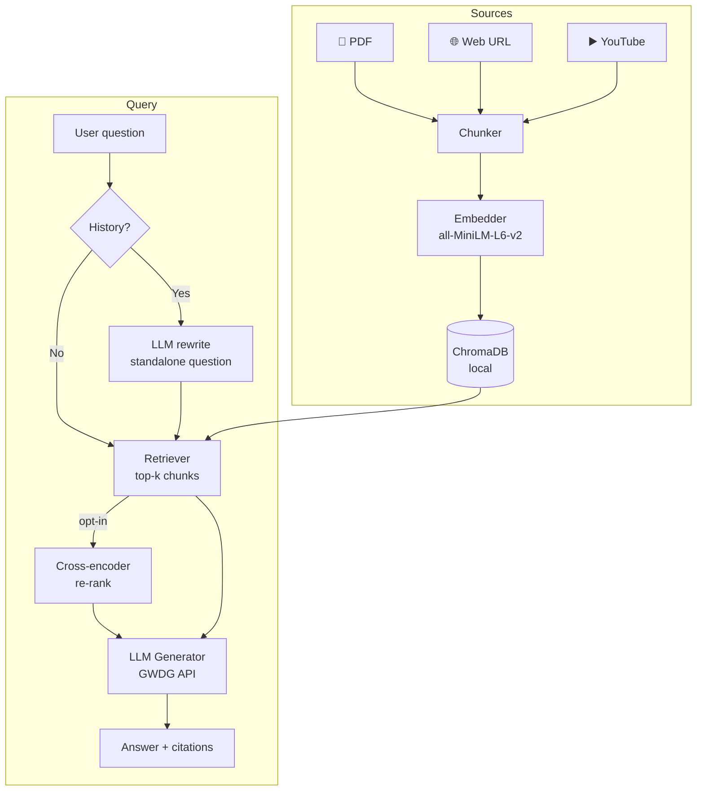

# Multi-Source Conversational RAG Assistant

A conversational AI assistant that lets you ingest documents from **PDFs, web pages, and YouTube videos**, then ask natural-language questions with multi-turn memory and source citations — all running locally with no external vector database.

---

## Demo

> *Add a demo GIF or screenshot here after recording a screen capture of the app in action.*

---

## Features

| Feature | Details |
|---|---|
| **Multi-source ingestion** | PDF upload · Web URL (trafilatura) · YouTube transcript (youtube-transcript-api) |
| **Semantic search** | Sentence-transformer embeddings (`all-MiniLM-L6-v2`) stored in local ChromaDB |
| **Source diversity** | Per-source retrieval cap ensures multiple sources contribute to every answer |
| **Conversational memory** | Follow-up questions resolved via LLM query rewriting before retrieval |
| **Source citations** | Numbered `[1]`, `[2]` inline citations with a collapsible Sources expander; YouTube links are timestamped |
| **Re-ranking (opt-in)** | Cross-encoder (`ms-marco-MiniLM-L-6-v2`) re-scores retrieved chunks — runs locally, no API needed |
| **Live pipeline display** | Step-by-step progress card (Rewrite → Retrieve → Generate) visible while the model thinks |

---

## Architecture



**Data flow:**

1. **Write path** — Source → Chunker (500 chars, 50 overlap) → Embedder → ChromaDB
2. **Read path** — Query → *(optional) LLM rewrite* → Retriever → *(optional) cross-encoder re-rank* → LLM Generator → Answer with citations

---

## Quick Start

### Prerequisites

- Python 3.10+
- [uv](https://docs.astral.sh/uv/) — `pip install uv`
- A GWDG API key (or any OpenAI-compatible endpoint)

### Installation

```bash
git clone https://github.com/<your-username>/multi-source-conversational-rag.git
cd multi-source-conversational-rag

cp .env.example .env          # fill in your API credentials
make install                  # creates .venv and installs all dependencies
make run                      # launches the Streamlit app at http://localhost:8501
```

### Environment variables

Copy `.env.example` to `.env` and fill in:

| Variable | Description |
|---|---|
| `GWDG_API_KEY` | API key for the GWDG (or any OpenAI-compatible) LLM endpoint |
| `GWDG_API_BASE` | Base URL, e.g. `https://chat-ai.academiccloud.de/v1` |
| `GWDG_MODEL_NAME` | Model name, e.g. `meta-llama-3.1-70b-instruct` |
| `HF_HUB_DISABLE_SYMLINKS_WARNING` | Set to `1` on Windows to suppress a cosmetic HuggingFace warning |

---

## Deployment on Streamlit Community Cloud

1. Push the repo to GitHub.
2. Go to [share.streamlit.io](https://share.streamlit.io) → **New app**.
3. Set **Main file path** to `app/app.py`.
4. Under **Advanced settings → Secrets**, paste the contents of `.streamlit/secrets.toml.example` with your real credentials.
5. Deploy — Streamlit Cloud installs from `requirements.txt` automatically.

> The bi-encoder and cross-encoder models (~90 MB each) are downloaded from HuggingFace on first use and cached for the session lifetime.

---

## Development

```bash
make lint                                    # ruff check + format
uv run pytest tests/                         # run all tests (80 tests, no API calls)
uv run pytest tests/test_ingestion.py        # run a single file
uv run python scripts/reset_vectorstore.py   # wipe ChromaDB and start fresh
```

---

## Project Structure

```
├── app/
│   ├── app.py                  # Streamlit entry point
│   ├── page_config.py          # page title / icon / layout constants
│   └── components/
│       ├── chat.py             # chat UI, citation rendering, pipeline progress card
│       ├── sidebar.py          # source ingestion forms + retrieval settings
│       └── source_viewer.py    # ingested sources list with delete buttons
│
├── rag/
│   ├── ingestion/
│   │   ├── base.py             # Document dataclass + Ingestor ABC
│   │   ├── pdf_ingestor.py     # PyMuPDF — one Document per page
│   │   ├── web_ingestor.py     # trafilatura — article extraction
│   │   └── youtube_ingestor.py # youtube-transcript-api — timestamp-bounded chunks
│   ├── chunking/chunker.py     # RecursiveCharacterTextSplitter wrapper
│   ├── embeddings/embedder.py  # sentence-transformers bi-encoder
│   ├── vectorstore/chroma_store.py
│   ├── retrieval/retriever.py  # top-k + per-source cap + optional cross-encoder rerank
│   ├── generation/generator.py # LangChain → GWDG LLM, citation prompt
│   ├── memory/conversation.py  # query rewriting with conversation history
│   ├── models.py               # Citation + Answer dataclasses, citation regex
│   └── pipeline.py             # orchestrator — exposes ingest / ask / granular steps
│
├── config/settings.py          # all tunables in one place (reads .env + st.secrets)
├── tests/                      # 80 pytest tests, all offline (LLM and HTTP mocked)
├── .streamlit/
│   ├── config.toml             # theme + server settings
│   └── secrets.toml.example    # Streamlit Cloud secrets template
├── requirements.txt            # pinned deps for Streamlit Cloud (generated by uv)
└── pyproject.toml              # project metadata + ruff config
```

---

## Tech Stack

| Layer | Library |
|---|---|
| UI | Streamlit 1.39+ |
| LLM integration | LangChain + langchain-openai |
| Embeddings | sentence-transformers `all-MiniLM-L6-v2` (384-dim) |
| Re-ranking | sentence-transformers `cross-encoder/ms-marco-MiniLM-L-6-v2` |
| Vector store | ChromaDB (local, file-persisted) |
| PDF parsing | PyMuPDF |
| Web extraction | trafilatura |
| YouTube transcripts | youtube-transcript-api |
| Linting / formatting | Ruff |
| Testing | pytest |
| Package management | uv |

---

## Possible Future Improvements

- **Translation** — `youtube-transcript-api` supports `.translate('en').fetch()` on non-English transcripts; useful when auto-generated captions exist only in the video's original language
- **Re-ranking as default** — once the cross-encoder model is pre-warmed at startup, the added latency becomes negligible
- **Query expansion** — generate multiple search queries from a single user question and merge results before re-ranking
- **Streaming answers** — use LangChain's streaming callbacks to show the LLM response token-by-token
- **Multi-collection support** — separate ChromaDB collections per project / workspace
- **Evaluation harness** — RAGAS or TruLens metrics (faithfulness, answer relevancy, context precision) for systematic quality tracking

---

## License

MIT — see [LICENSE](LICENSE).
