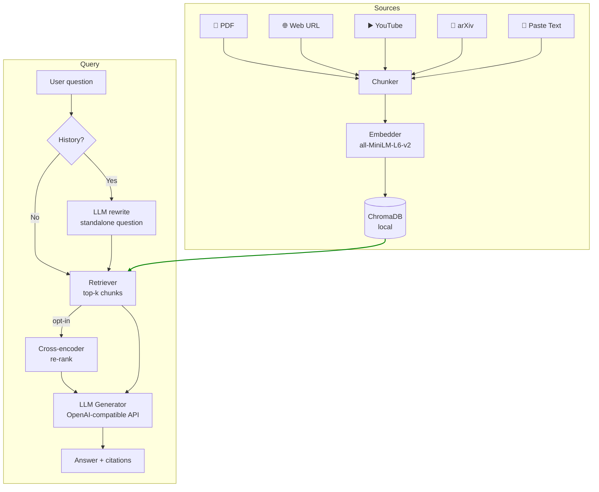

# Multi-Source Conversational RAG Assistant

[](https://multi-source-conversational-rag.streamlit.app/)

<p align="center">
  
  
  
  
  
  
  
  
  
  
  
  
</p>

A conversational AI assistant that lets you ingest content from **PDFs, arXiv papers, web pages, YouTube videos, or plain pasted text**, then ask natural-language questions with multi-turn memory and source citations — all running locally with no external vector database.

---

## Table of Contents

- [Demo](#demo)
- [Features](#features)
- [Architecture](#architecture)
- [Quick Start](#quick-start)
- [Development](#development)
- [Project Structure](#project-structure)
- [Tech Stack](#tech-stack)
- [Possible Future Improvements](#possible-future-improvements)
- [License](#license)
- [Author](#author)

---

## Demo


The demo walks through the full pipeline end-to-end:

1. **Ingest three sources** from the sidebar:
   - 📄 **PDF** — [*"Query Rewriting for Retrieval-Augmented Large Language Models"* (Ma et al., 2023)](https://arxiv.org/abs/2305.14283)
   - 🌐 **Web page** — [AWS article on Retrieval-Augmented Generation](https://aws.amazon.com/what-is/retrieval-augmented-generation/)
   - ▶️ **YouTube video** — [IBM explainer on RAG](https://www.youtube.com/watch?v=qppV3n3YlF8)

2. **Enable re-ranking** in the sidebar — a local cross-encoder re-scores retrieved chunks for higher accuracy (no API needed).

3. **Ask a direct question** — the app retrieves the most relevant chunks, generates an answer, and shows numbered inline citations `[1]`, `[2]` linked back to their sources.

4. **Ask a follow-up question** — the app automatically rewrites the ambiguous query into a standalone question using conversation history. The rewritten query is visible in a collapsible expander below the answer.

---

## Features

| Feature | Details |
|---|---|
| **Multi-source ingestion** | PDF upload · arXiv paper (by ID or URL) · Web URL (trafilatura) · YouTube transcript (youtube-transcript-api) · plain text (paste) |
| **Semantic search** | Sentence-transformer embeddings (`all-MiniLM-L6-v2`) stored in local ChromaDB |
| **Source diversity** | Per-source retrieval cap ensures multiple sources contribute to every answer |
| **Conversational memory** | Follow-up questions resolved via LLM query rewriting before retrieval |
| **Source citations** | Numbered `[1]`, `[2]` inline citations with a collapsible Sources expander; YouTube links are timestamped |
| **Re-ranking (opt-in)** | Cross-encoder (`ms-marco-MiniLM-L-6-v2`) re-scores retrieved chunks — runs locally, no API needed |
| **Hybrid search (opt-in)** | BM25 keyword search fused with dense vector search via Reciprocal Rank Fusion — improves recall for exact keyword queries |
| **Retrieval tuning** | Top K chunks (3–15) and max-per-source cap (1–5) are adjustable via sidebar sliders per query |
| **Live pipeline display** | Step-by-step progress card (Rewrite → Retrieve → Generate) visible while the model thinks |
| **Export conversation** | Download the full chat as a PDF with one click |

---

## Architecture



**Data flow:**

1. **Write path** — Source → Chunker (500 chars, 50 overlap) → Embedder → ChromaDB
2. **Read path** — Query → *(optional) LLM rewrite* → Retriever → *(optional) cross-encoder re-rank* → LLM Generator → Answer with citations

---

## Quick Start

### Prerequisites

- Python 3.11+
- [uv](https://docs.astral.sh/uv/) — `pip install uv`
- An API key for any **OpenAI-compatible LLM endpoint** (see environment variables below)

### Installation

```bash
git clone https://github.com/farmand-bt/multi-source-conversational-rag.git
cd multi-source-conversational-rag

cp .env.example .env          # fill in your API credentials
make install                  # creates .venv and installs all dependencies
make run                      # launches the Streamlit app at http://localhost:8501
```

> **First run:** the embedding model (`all-MiniLM-L6-v2`, ~90 MB) and re-ranking model (`ms-marco-MiniLM-L-6-v2`, ~90 MB) are downloaded from HuggingFace on first use and cached locally. Expect a one-time wait of 1–2 minutes on a typical connection.

### Environment variables

The app connects to **any OpenAI-compatible LLM API** — you are not locked into a specific provider. The environment variable names use the `GWDG_` prefix because [GWDG](https://www.gwdg.de/) is the provider used during development (it offers free API access to students at universities in Niedersachsen, Germany), but the values work with any compatible endpoint such as OpenAI, Together AI, Groq, or a self-hosted model.

Copy `.env.example` to `.env` and fill in:

| Variable | Required | Description |
|---|---|---|
| `GWDG_API_KEY` | ✅ | Your LLM API key |
| `GWDG_API_BASE` | ✅ | Base URL of your provider, e.g. `https://chat-ai.academiccloud.de/v1` (GWDG) or `https://api.openai.com/v1` (OpenAI) |
| `GWDG_MODEL_NAME` | ✅ | Model name to request, e.g. `meta-llama-3.1-70b-instruct` (GWDG) or `gpt-4o` (OpenAI) |
| `HF_TOKEN` | ☑️ optional | HuggingFace token — only needed to access gated models. The embedding and re-ranking models used here are public, so this can be left empty. |
| `HF_HUB_DISABLE_SYMLINKS_WARNING` | ☑️ optional | Set to `1` on Windows to suppress a cosmetic HuggingFace cache warning (no functional impact). |

---

## Development

```bash
make lint                                    # ruff check + format
uv run pytest tests/                         # run all tests (80 tests, no API calls)
uv run pytest tests/test_ingestion.py        # run a single file
uv run python scripts/reset_vectorstore.py   # wipe ChromaDB and start fresh
```

---

## Project Structure

```
├── app/
│   ├── app.py                  # Streamlit entry point
│   ├── page_config.py          # page title / icon / layout constants
│   └── components/
│       ├── chat.py             # chat UI, citation rendering, pipeline progress card
│       ├── sidebar.py          # source ingestion forms + retrieval settings
│       └── source_viewer.py    # ingested sources list with delete buttons
│
├── rag/
│   ├── ingestion/
│   │   ├── base.py             # Document dataclass + Ingestor ABC
│   │   ├── pdf_ingestor.py     # PyMuPDF — one Document per page
│   │   ├── web_ingestor.py     # trafilatura — article extraction
│   │   ├── youtube_ingestor.py # youtube-transcript-api — timestamp-bounded chunks
│   │   ├── arxiv_ingestor.py   # downloads arXiv PDF by ID or URL → delegates to PDFIngestor
│   │   └── text_ingestor.py    # plain text paste — one Document, no location metadata
│   ├── chunking/chunker.py     # RecursiveCharacterTextSplitter wrapper
│   ├── embeddings/embedder.py  # sentence-transformers bi-encoder
│   ├── vectorstore/chroma_store.py
│   ├── retrieval/retriever.py  # top-k + per-source cap + optional cross-encoder rerank
│   ├── generation/generator.py # LangChain → OpenAI-compatible LLM, citation prompt
│   ├── memory/conversation.py  # query rewriting with conversation history
│   ├── models.py               # Citation + Answer dataclasses, citation regex
│   └── pipeline.py             # orchestrator — exposes ingest / ask / granular steps
│
├── config/settings.py          # all tunables in one place (reads .env + st.secrets)
├── tests/                      # 80 pytest tests, all offline (LLM and HTTP mocked)
├── .streamlit/
│   ├── config.toml             # theme + server settings
│   └── secrets.toml.example    # Streamlit Cloud secrets template
├── requirements.txt            # pinned deps for Streamlit Cloud (generated by uv)
└── pyproject.toml              # project metadata + ruff config
```

---

## Tech Stack

| Layer | Library |
|---|---|
| UI | Streamlit 1.39+ |
| LLM integration | LangChain + langchain-openai (any OpenAI-compatible endpoint) |
| Embeddings | sentence-transformers `all-MiniLM-L6-v2` (384-dim) |
| Re-ranking | sentence-transformers `cross-encoder/ms-marco-MiniLM-L-6-v2` |
| Vector store | ChromaDB (local, file-persisted) |
| PDF parsing | PyMuPDF |
| arXiv ingestion | requests (PDF download) + arXiv Atom API (title fetch, no key) |
| Web extraction | trafilatura |
| YouTube transcripts | youtube-transcript-api |
| PDF export | fpdf2 |
| Browser timezone detection | streamlit-javascript · tzdata |
| Linting / formatting | Ruff |
| Testing | pytest |
| Package management | uv |

---

## Possible Future Improvements

| Improvement | How | Effort | Cost |
|---|---|---|---|
| **More source types** (Notion, Google Docs) | `notion-client` (Notion API token); `google-api-python-client` (OAuth2). Each is a new `Ingestor` subclass | Medium per source | Free tiers available; Google Docs requires OAuth setup |
| **User authentication** | Per-session data isolation is already implemented (ephemeral in-memory ChromaDB per session). Remaining work: login/access control via Streamlit Community Cloud viewer auth (Google/GitHub) or `streamlit-authenticator` | Medium | Streamlit Cloud free tier supports viewer auth |

---

## License

MIT — see [LICENSE](LICENSE).

---

## Author

[**Farmand Bazdiditehrani**](https://www.linkedin.com/in/farmand-bt/) · M.Sc. in Management & Data Science · [farmand.bazdiditehrani@gmail.com](mailto:farmand.bazdiditehrani@gmail.com)
